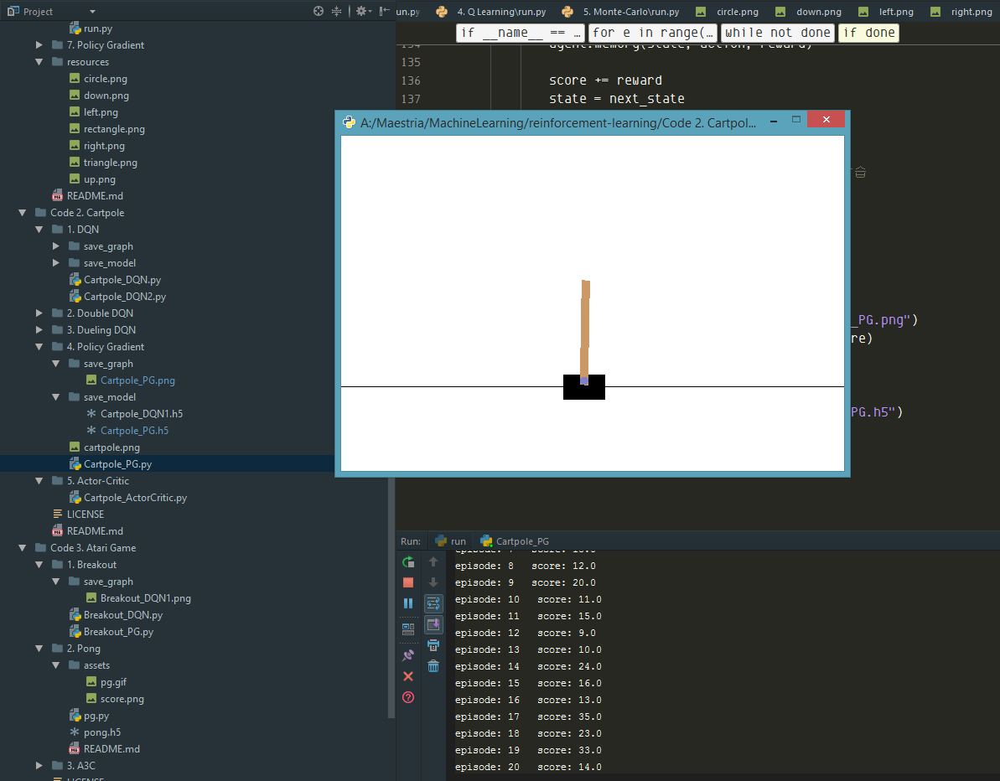
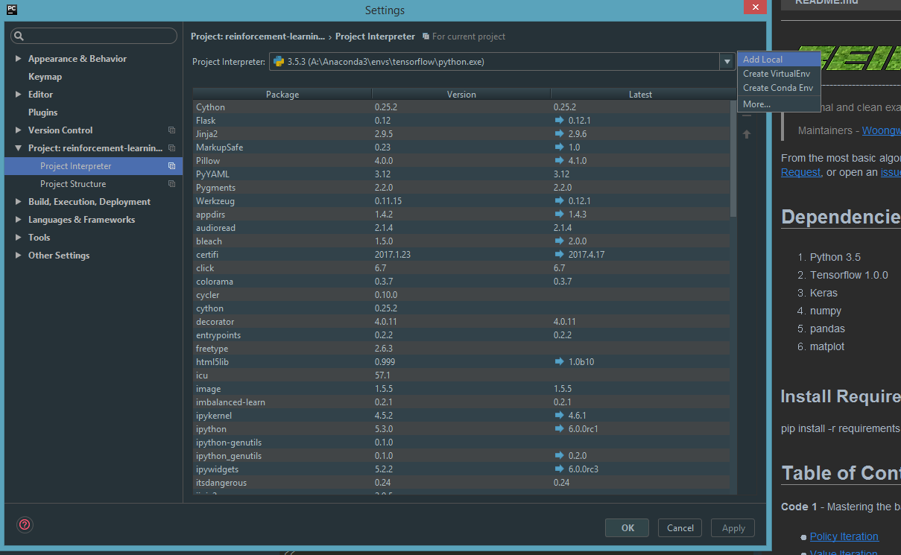
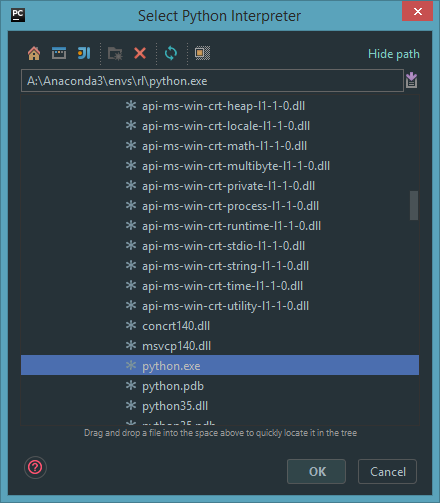

# How To run examples on windows, step by step. 
Traditionally machine learning applications could only run in Linux or MacOS environments.  

In this wiki you will learn how to configure your **windows** environment so you can run the examples.


# Go for it.
Recommended for greater compatibility

## Python Interpreter:
- Download & Install [Anaconda](https://www.continuum.io/downloads), pick Python 3.6 version 64 Bit Installer
Test installation on Windows console

```
python --version
Python 3.6.0 :: Anaconda custom (64-bit)
```
## Set virtual env to run examples
```
# Create env, you can pick any version of python, but for run this repo
conda create --name rl python=3.5 

# Activate env
activate rl

# Install TensorFlow, the easy way
conda install -c conda-forge tensorflow
conda install -c anaconda scipy=0.19.0

mkdir examples
cd examples
git clone https://github.com/rlcode/reinforcement-learning
cd reinforcement-learning

# Install Requirements
pip install -r requirements.txt

# Check
conda list

# Test the code
cd "Code 1. Grid World\1. Policy Iteration"
python run.py
```

# Next Steps.
- Need a IDE to easy manage the python scripts, Download & Install [PyCharm Community](https://www.jetbrains.com/pycharm/download/#section=windows) its free.

## Linking PyCharm with Anaconda Env.
- Open Project with PyCharm IDE: File > Open > Pick Folder (c:\examples\reinforcement-learning)
- File > Settings > Project Interpreter > Add Local
  

- Note: Need to pick python environment interpreter i.e located in c:\Anaconda3\envs\rl


- If all is ok.


- Play It (Run).


